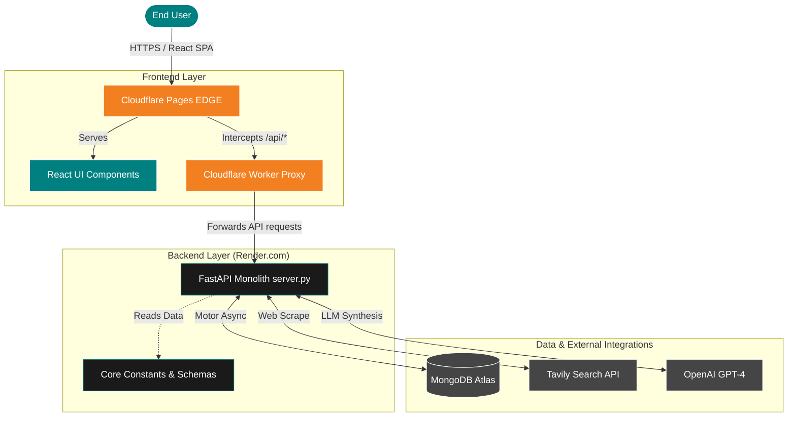
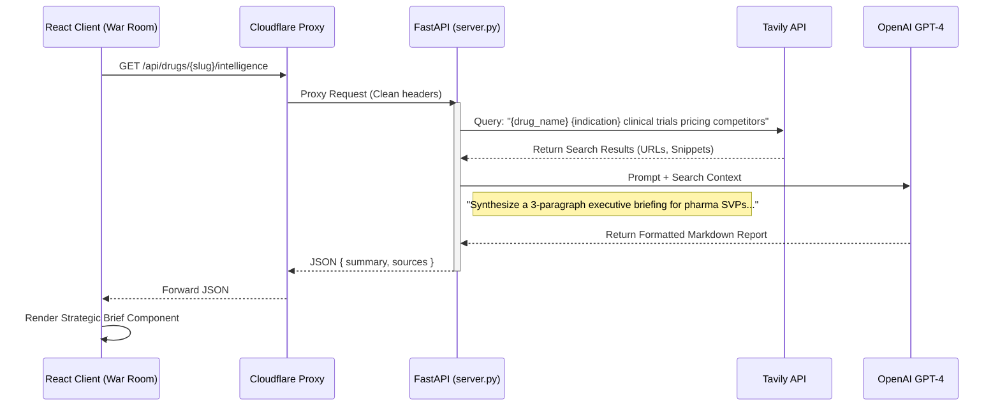

# DROP Tax: Architecture Mapping & System Design Report

## 1. Executive Summary

**Product Overview**
DROP Tax is an RWE (Real-World Evidence) Strategic Operating System designed for pharmaceutical market access and commercial strategy teams. It translates clinical efficacy and safety data into economic models (e.g., Liability vs. Drug Cost, Adverse-Event Costs) to optimize payer negotiations, formulate Patient Assistance Programs (PAPs), and generate boardroom-ready Global Value Dossiers.

**High-Level Components**
The system is built as a decoupled Client-Server architecture:
1.  **Frontend (SPA)**: A React 19 application providing a "Bloomberg-terminal" style interface, data visualization (Recharts), and interactive scenario modeling.
2.  **Backend (API Monolith)**: A Python FastAPI service handling business logic, AI-driven strategic synthesis (OpenAI/Tavily), MongoDB data retrieval, and dynamic PDF generation.
3.  **Edge Routing**: Cloudflare Pages hosts the frontend and utilizes a Worker (`_worker.js`) to cleanly proxy API requests to the off-site backend.

**Top 3 Immediate SRE & Architectural Risks (Technical Debt)**
> [!WARNING]
> 1.  **Monolithic Fat Controller (`server.py`)**: The entire API routing, business logic, LLM interaction, and PDF drawing code is crammed into a single 2,600+ line file. This severely impacts maintainability, testability, and concurrent development. It must be refactored into distinct Routers, Services, and Utilities.
> 2.  **Hardcoded Edge Proxying**: The Cloudflare edge proxy (`frontend/public/_worker.js`) contains a hardcoded reference to the production Render backend URL. Any infrastructure migration will require a code change and full rebuild rather than a simple environment variable toggle.
> 3.  **Destructive Database Scripting**: The database is initialized via a destructive seed script (`seed_regions.py` which calls `delete_many({})`), completely bypassing safe, versioned database migrations. This creates a high risk of catastrophic data loss in production if accidentally executed.

---

## 2. Repository Discovery Report

### Directory Map & Entry Points

```text
/DropTax-main
│
├── /frontend               (React SPA Interface)
│   ├── package.json        (Dependencies & build scripts)
│   ├── craco.config.js     (Webpack override configuration)
│   ├── /public
│   │   └── _worker.js      (Cloudflare Edge Proxy - API routing)
│   └── /src
│       ├── index.js        (React Entry Point)
│       ├── App.jsx         (Client-side routing via React Router)
│       ├── /context        (AppContext.js - Global state & Persistence)
│       ├── /pages          (WhiteRoom, ExecutiveDashboard, WarRoom)
│       └── /components     (Rich UI components, Charts, Modals)
│
└── /backend                (FastAPI Python Engine)
    ├── requirements.txt    (Python dependencies)
    ├── Dockerfile          (Single-stage container build definition)
    ├── server.py           (API Entry Point & Monolith Controller)
    ├── seed_regions.py     (Destructive DB initialization script)
    ├── /core
    │   └── constants.py    (Hardcoded pricing, payer tiers, schemas)
    └── /models
        └── schemas.py      (Pydantic input/output validation models)
```

### Build & Tooling
-   **Frontend Build**: `craco build` (wrapped via `npm run build` with `CI=false` to bypass linting blockers).
-   **Backend Environment**: Python 3.11 with `uvicorn` ASGI server.
-   **Local Deployment**: Proxy configured in `package.json` to route `/api/*` to `localhost:8000`.

---

## 3. Product Capability Map

By analyzing the frontend views and backend logic, the system's functional capabilities map to the following modules:

| Functional Area | Core Responsibility | Frontend Module | Backend Dependency |
| :--- | :--- | :--- | :--- |
| **Molecule Intelligence** | Autocomplete search, multi-indication selection, and global availability tracking. | `WhiteRoom.jsx`, `IndicationSelectDialog.jsx` | `/api/drugs/search` (Fuzzy matching), `REGIONAL_DRUG_AVAILABILITY` |
| **Market Radar & AI Threat Feed** | Sweeping external web sources for competitive intelligence, clinical trial updates, and patent threats. | `ExecutiveDashboard.jsx`, `StrategicBrief.jsx` | `/api/drugs/{slug}/intelligence`, Tavily API, OpenAI GPT-4 |
| **Liability & HEOR Modeling** | Calculating the "hidden cost" of treatment failure (ICU crashes, productivity loss) vs. the drug cost. | `ValueBridge.jsx`, `ExecutiveDashboard.jsx` | Dynamic math in `server.py`, `constants.py` |
| **Head-to-Head Simulation** | The "Competitive Thunderdome". Evaluating a drug against a selected competitor including "Adverse-Event Costs". | `WarRoom.jsx`, `TPPBenchmarker.jsx` | `/api/drugs/{slug}/competitors` |
| **Deal Architect (PAP)** | Payer segment routing and calculating Patient Assistance Programs based on wallet capacity vs. affordability gap. | `WarRoom.jsx` (Deal Architect Tab) | `PAP_SCHEMES` dictionary, Payer Segment algorithms |
| **Executive Export** | Generating localized, boardroom-ready Global Value Dossiers incorporating all live data and generated charts. | `WarRoom.jsx` (Generate Dossier) | `/api/drugs/{slug}/pdf`, ReportLab Engine |

---

## 4. Solution Architecture

### High-Level Component Diagram



### Typical Request/Response Flow (Intelligence Generation)

This flow illustrates how the system compiles the AI Strategic Brief for a molecule, highlighting the sequential dependencies.



### Refactoring Priority (Path to Production)
To graduate this prototype to a production-grade application, the immediate architectural priority must be dismantling `server.py`. 
1.  **Extract Routing**: Move distinct domain routes (e.g., `drugs.py`, `intelligence.py`, `pdf.py`) into the empty `backend/routers/` directory.
2.  **Extract Services**: Move external API calls (Tavily, OpenAI) and PDF ReportLab generation logic into the `backend/services/` directory.
3.  **Implement Migrations**: Introduce an ORM/Migration tool (like Beanie + simplified migration scripts) to replace `seed_regions.py`.
