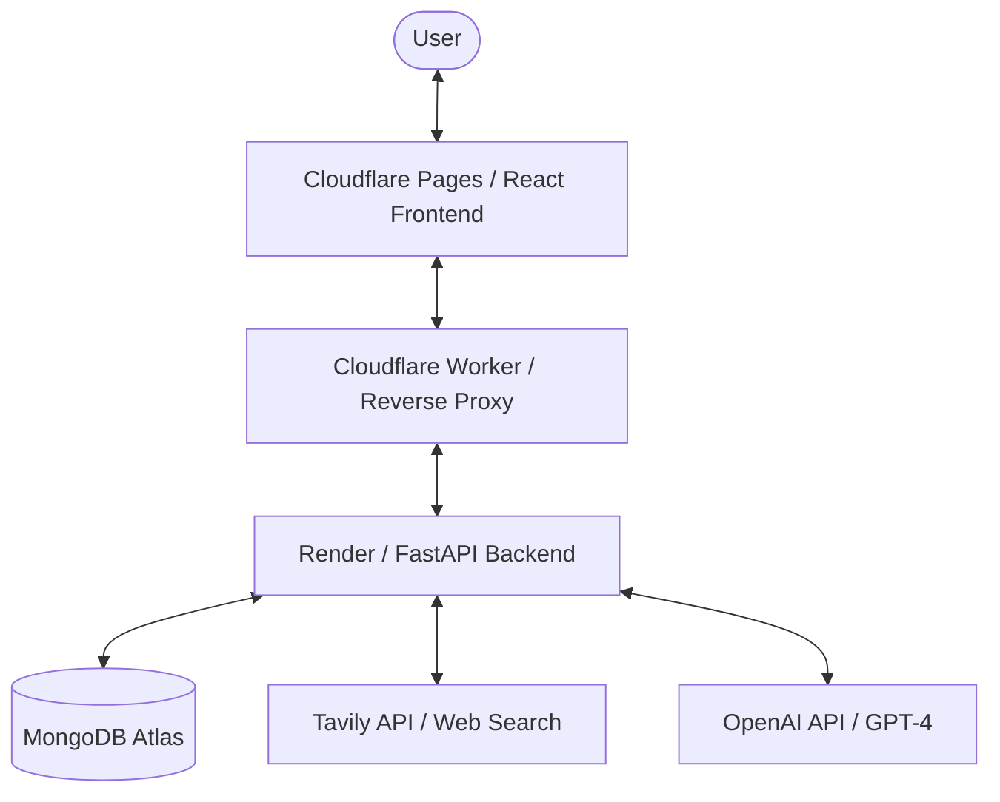

# Project Onboarding & Knowledge Transfer (KT)

Welcome to the DROP Tax project! This document provides a deep dive into the architecture, codebase, and development workflow.

## Project Vision
DROP Tax is an intelligence platform for CardioMetabolic and Women's Health therapeutics. It provides real-time data on drug approvals, clinical trials, pricing, and market availability across different regions (India, Singapore, UAE).

## High-Level Architecture



## Backend Deep Dive (FastAPI)
The backend is located in the `/backend` directory.

### Core Components:
- **`server.py`**: The main entry point. Defines API routes and core logic for drug search, pricing calculations, and clinical data extraction.
- **`models/schemas.py`**: Pydantic models for request/response validation.
- **`core/constants.py`**: Static data for regional pricing fallbacks, payer segments, and local drug metadata.
- **`services/`**: Helper services for external API integrations (Tavily, OpenAI).

### Key Features:
- **Dynamic Drug Search**: Uses fuzzy matching against a local database and falls back to real-time web search via Tavily for unknown drugs.
- **Pricing Engine**: Calculates patient out-of-pocket costs based on regional list prices, payer segments (Insurance, OOP, Govt), and Patient Assistance Programs (PAP).
- **Intelligence Reports**: Synthesizes clinical data into executive summaries and visual charts using GPT-4.

## Frontend Deep Dive (React)
The frontend is located in the `/frontend` directory.

### Core Stack:
- **React 19**: UI library.
- **Tailwind CSS**: Styling.
- **Recharts**: Data visualization.
- **Lucide React**: Iconography.
- **Radix UI**: Accessible UI primitives.

### Key Screens:
- **`ExecutiveDashboard.jsx`**: High-level overview of drug status and market data.
- **`WarRoom.jsx`**: Comparative analysis screen (Competitive Thunderdome).
- **`IntelligenceReport.jsx`**: Renders detailed AI-generated reports.

## Local Development Setup

### 1. Prerequisites
- Python 3.9+
- Node.js 18+
- MongoDB (Local instance or Atlas URI)

### 2. Backend Setup
```bash
cd backend
python -m venv venv
source venv/bin/activate  # Mac/Linux
pip install -r requirements.txt
# Create .env from template and add API keys
python server.py
```

### 3. Frontend Setup
```bash
cd frontend
npm install
npm start
```

## Command Reference

| Action | Command |
| :--- | :--- |
| **Run Backend** | `cd backend && python server.py` |
| **Run Frontend** | `cd frontend && npm start` |
| **Build Frontend** | `cd frontend && npm run build` |
| **Seed Database** | `cd backend && python seed_regions.py` |

## Resources
- [Deployment Guide](./DEPLOYMENT_GUIDE.md)
- [Design Guidelines](../design_guidelines.json)
